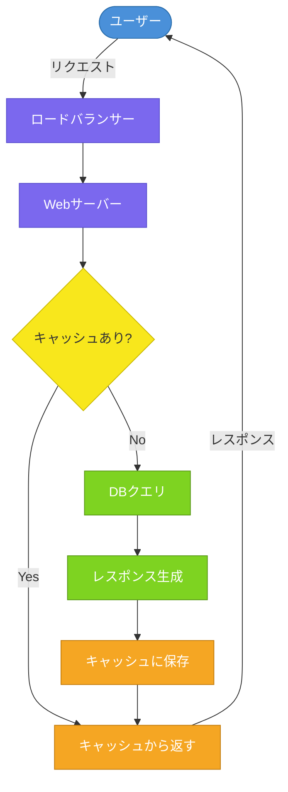
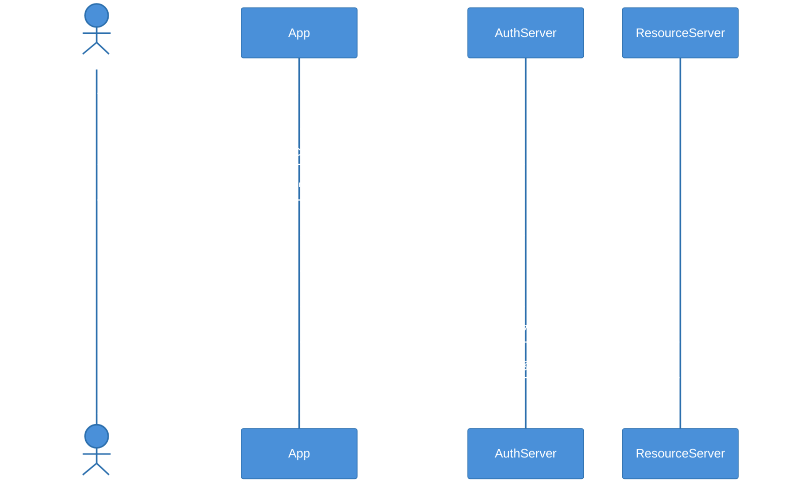
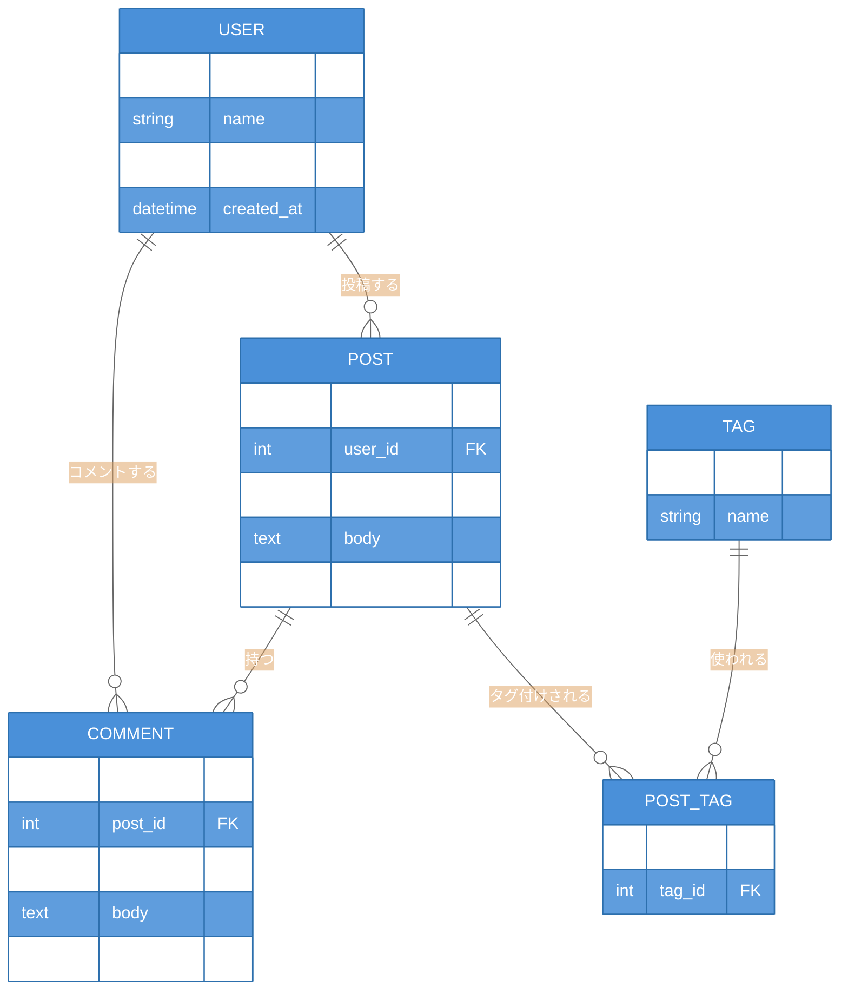
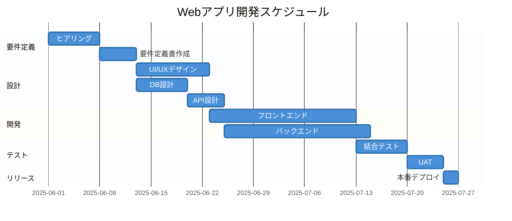

# Mermaid 図サンプル集

GitHub の Markdown で使える Mermaid 図のサンプルです。

---

## 1. フローチャート

システムのリクエスト処理フローの例。



---

## 2. シーケンス図

OAuth 2.0 認証フローの例。



---

## 3. ER図

ブログアプリのデータモデルの例。



---

## 4. 状態遷移図

ECサイトの注文ステータス遷移の例。

```mermaid
stateDiagram-v2
    classDef active fill:#4A90D9,color:#fff,font-weight:bold
    classDef success fill:#7ED321,color:#fff,font-weight:bold
    classDef warning fill:#F5A623,color:#fff,font-weight:bold
    classDef danger fill:#D0021B,color:#fff,font-weight:bold

    [*] --> 注文受付
    注文受付 --> 支払い待ち : 注文確定
    支払い待ち --> 準備中 : 支払い完了
    支払い待ち --> キャンセル済み : 期限切れ
    準備中 --> 発送済み : 発送処理
    準備中 --> キャンセル済み : キャンセル申請
    発送済み --> 配達完了 : 配達
    配達完了 --> 返品受付 : 返品申請
    返品受付 --> 返金済み : 返金処理
    配達完了 --> [*]
    キャンセル済み --> [*]
    返金済み --> [*]

    class 注文受付,支払い待ち,準備中 active
    class 発送済み,配達完了 success
    class 返品受付,返金済み warning
    class キャンセル済み danger
```

---

## 5. ガントチャート

Webアプリ開発プロジェクトのスケジュール例。


